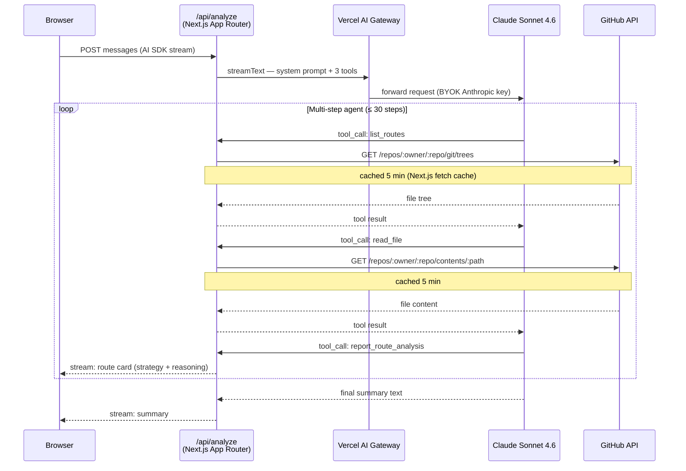

# Render Right

**AI-powered rendering strategy advisor for Next.js apps.**

Paste a public GitHub repo URL and an agentic AI reads every route file, classifies the current rendering strategy, and streams back per-route recommendations — with cost impact, performance reasoning, and a one-line implementation hint for each change.

---

## What it does

Most Next.js apps default to SSR everywhere because it feels safe. That means every page load hits a serverless function, LCP suffers, and infrastructure costs are higher than they need to be. Render Right reads your codebase and tells you exactly which routes can be shifted to SSG, ISR, PPR, or Edge — and why.

For each route the agent reports:

| Field | Example |
|---|---|
| Current strategy | `SSR` |
| Recommended strategy | `ISR` |
| Cost impact | `high-savings` |
| Performance impact | `LCP improves ~40% — removes cold-start latency` |
| Implementation hint | `Add: export const revalidate = 3600` |
| Priority | `high` |

Cards stream into the UI progressively as the agent reads files — you see results for each route as soon as they're ready, not after the full repo scan completes.

---

## How it works



The agent runs entirely server-side: `streamText` with `stopWhen: stepCountIs(30)` handles the tool-call loop without any client round-trips between steps. `toUIMessageStreamResponse()` pipes the AI SDK v6 UI message stream directly to the browser, so route cards appear in real time.

---

## Stack

| Layer | Technology |
|---|---|
| Framework | Next.js 16 (App Router) |
| AI orchestration | [AI SDK v6](https://ai-sdk.dev) — `streamText`, `tool`, `useChat`, `DefaultChatTransport` |
| Model | Claude Sonnet 4.6 |
| Model routing | [Vercel AI Gateway](https://vercel.com/docs/ai-gateway) + Anthropic BYOK |
| Prompt caching | Anthropic ephemeral cache on system prompt — cuts repeat-request latency |
| Styling | Tailwind CSS v4 |
| Language | TypeScript |

---

## Vercel AI Gateway

All model requests route through [Vercel AI Gateway](https://vercel.com/docs/ai-gateway), which provides:

- **One key, many models** — swap the model string to try any provider without code changes
- **BYOK (Bring Your Own Key)** — your existing Anthropic credits are used with no token markup; the gateway falls back to system credentials automatically if your key fails
- **Observability** — spend tracking, request logs, and latency metrics in the Vercel dashboard
- **Fallbacks** — automatic retry to a backup provider if the primary returns an error

The production app uses `anthropic/claude-sonnet-4.6`. The eval harness tests across multiple models simultaneously — see [Evals](#evals) below.

---

## Evals

A hand-rolled eval harness (`evals/run.ts`) scores the agent's `recommendedStrategy` against 8 annotated test cases. Running it across multiple models produces a side-by-side comparison table, making it easy to spot where different models disagree or struggle:

```
🧪  Running 8 eval cases across 3 model(s):
    • anthropic/claude-haiku-4.5
    • google/gemini-2.5-flash
    • meta/llama-4-scout

📊  Model comparison (8 test cases)
─────────────────────────────────────────────────────────────────────────────
Case                              claude-haiku-4 gemini-2.5-fla llama-4-scout
─────────────────────────────────────────────────────────────────────────────
static-marketing                  ✅ SSG         ✅ SSG         ✅ SSG
blog-post-isr                     ✅ ISR         ✅ ISR         ✅ ISR
dashboard-with-cookies            ✅ SSR         ✅ SSR         ✅ SSR
product-page-no-cache             ❌ NO_RESULT   ✅ ISR         ✅ ISR
search-results-searchparams       ✅ SSR         ✅ SSR         ✅ SSR
ppr-candidate                     ✅ PPR         ✅ PPR         🟡 ISR
edge-geo                          ✅ Edge        ✅ Edge        ✅ Edge
force-dynamic-on-static           ✅ SSG         ✅ SSG         ✅ SSG
─────────────────────────────────────────────────────────────────────────────
Score (exact / acceptable)        7/8  7/8      8/8  8/8      7/8  8/8
```

PPR and ISR are treated as acceptable variance — both are valid recommendations for some patterns. The `product-page-no-cache` miss on Haiku points to a specific prompt gap: implicit `Cache-Control: no-store` on an otherwise static page sits right at the boundary of its classification ability.

Run evals locally:

```bash
AI_GATEWAY_API_KEY=$(grep AI_GATEWAY_API_KEY .env.local | cut -d= -f2) npm run eval
```

Override which models are tested:

```bash
AI_GATEWAY_API_KEY=... EVAL_MODELS=anthropic/claude-sonnet-4.6,google/gemini-2.5-pro npm run eval
```

---

## Local development

```bash
npm install
cp .env.example .env.local
# Fill in AI_GATEWAY_API_KEY (and optionally GITHUB_TOKEN)
npm run dev
```

Open [http://localhost:3000](http://localhost:3000).

### Environment variables

| Variable | Required | Purpose |
|---|---|---|
| `AI_GATEWAY_API_KEY` | Yes | Vercel AI Gateway API key — get from the Vercel dashboard |
| `GITHUB_TOKEN` | No | Raises GitHub rate limit from 60 → 5,000 req/hr for public repos |
| `SITE_PASSWORD` | No | Enables HTTP Basic Auth on the deployed site (`proxy.ts`) |

Configure your Anthropic key as BYOK in the Vercel dashboard under AI Gateway → Bring Your Own Key so requests use your existing Anthropic credits.

---

## Roadmap

- [x] [Edge Runtime on `/api/analyze`](https://github.com/micahwalter/render-right/issues/5) — uses `atob` + `TextDecoder` in `lib/github.ts` for Edge compatibility
- [x] [Copy-to-clipboard on `implementationHint` code snippets](https://github.com/micahwalter/render-right/issues/6)
- [ ] [Email / Slack report export](https://github.com/micahwalter/render-right/issues/7) — send the full analysis as a formatted digest
- [ ] [Private repo support](https://github.com/micahwalter/render-right/issues/8) — OAuth flow to obtain a scoped GitHub token from the user
- [ ] [Diff mode](https://github.com/micahwalter/render-right/issues/9) — re-analyze after making changes and highlight what improved
- [ ] [Configurable model in the UI](https://github.com/micahwalter/render-right/issues/10) — let users pick the analysis model at runtime via the gateway
- [ ] [Per-route cost estimate](https://github.com/micahwalter/render-right/issues/11) — attach dollar figures to recommendations based on expected traffic
- [ ] [Expanded eval coverage](https://github.com/micahwalter/render-right/issues/12) — more PPR vs. ISR boundary cases and edge runtime signal patterns
